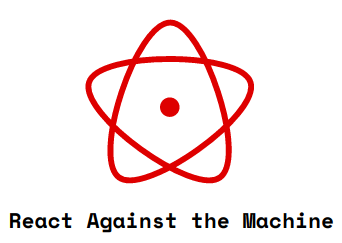

An state machine to react.

## Installation

```shell
npm i --save react-against-the-machine
```

## Node and npm version

The project needs this nodejs and npm version restrictions:

```json
"engines": {
  "node": ">=16.9.1 <16.8.0",
  "npm": "~7.24.0"
}
```

## Peer dependencies

This project has these peer dependencies:

```json
"peerDependencies": {
  "react": "^17.0.2",
  "react-dom": "^17.0.2"
}
```

In order to install this peer dependencies, you need an npm version up to 7.x.

This peer dependencies are installed by the `npm install` command.

## Tasks

### Buid

You could build this react state machine with:

```shell
npm run build
```

and take the bundle into `dist` folder

### Test

You could run tests with:

```shell
npm run test
```

#### Test watch

Run test with watch mode:

```shell
npm run test:watch
```

#### Test coverage

Run test generating coverage report:

```shell
npm run test:coverage
```

### Lint

lint your code with:

```shell
npm run lint
```

#### Lint fix

Fix your linted errors with:

```shell
npm run lint:fix
```

### Format

Format your code syntax with:

```shell
npm run format
```

## Usage

### Basic example

```
           ┌─────────────────────┐                 ┌───────────────────┐
           │                     │                 │                   │
           │                     │ go::componentB  │                   │
  ┌───────►│     StateA          ├────────────────►│      StateB       ├────────┐
  │        │                     │                 │                   │        │
  │        │                     │                 │                   │        │
  │        └─────────────────────┘                 └───────────────────┘        │
  │                                                                             │
  │                                                                             │
  │                                                                             │
  │                                                                             │
  │                                                                             │
  └─────────────────────────────────────────────────────────────────────────────┘
                                 go::componentA

```

```typescript
import React from 'react';

// import the react against the machine pieces
import Machine, { State, Transition, Content } from 'react-against-the-machine';
// import any bus that implements the ILaguagua interface
import { laGuaGua as bus } from 'laguagua';

import ComponentA from './componentA';
import ComponentB from './componentB';

const App = () => {
  const onTransitionToComponentB = (): void => {
    console.log('Hey we are in component B');
  };

  return (
    <>
      <Machine initial="componentA" bus={bus}>
        <State id="componentA" private={false}>
          <Content>
            <ComponentA />
          </Content>
          <Transition event="go::componentB" state="componentB" onEnter={onTransitionToComponentB} />
        </State>

        <State id="componentB" private={false}>
          <Content>
            <ComponentB />
          </Content>
          <Transition event="go::componentA" state="componentA" />
        </State>
      </Machine>
    </>
  );
};

export default App;
```
