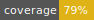

![[React against the machine]](assets/logo_small.jpg#gh-light-mode-only)
![[React against the machine]](assets/logo_small_black.jpg#gh-dark-mode-only)

An declarative state machine to react.

## Activity

[](LICENSE)





## Summary

- [Instalation](#installation)
- [Node and npm version](#node-and-npm-version)
- [Peer dependencies](#peer-dependencies)
- [Tasks](#taks)
  - [Build](#build)
  - [Test](#test)
  - [Test watch](#test-watch)
  - [Test coverage](#test-coverage)
  - [Lint](#lint)
  - [Lint fix](#lint-fix)
  - [Format](#format)
- [Components](#components)
  - [Components hierarchy](#components-hierarchy)
  - [Machine](#machine)
    - [Machine props](#machine-props)
      - [IBus interface](#ibus-interface)
  - [State](#state)
    - [State props](#state-props)
  - [Transition](#transition)
    - [Transition props](#transition-props)
  - [Context](#context)
- [Usage](#usage)
  - [Basic example](#basic-example)
  - [Real example](#real-example)

## Installation

```shell
npm i --save react-against-the-machine
```

## Node and npm version

The project needs this nodejs and npm version restrictions:

```json
"engines": {
  "node": ">=16.9.1 <16.8.0",
  "npm": "~7.24.0"
}
```

## Peer dependencies

This project has these peer dependencies:

```json
"peerDependencies": {
  "react": "^17.0.2",
  "react-dom": "^17.0.2"
}
```

In order to install this peer dependencies, you need an npm version up to 7.x.

This peer dependencies are installed by the `npm install` command.

## Tasks

### Buid

You could build this react state machine with:

```shell
npm run build
```

and take the bundle into `dist` folder

### Test

You could run tests with:

```shell
npm run test
```

#### Test watch

Run test with watch mode:

```shell
npm run test:watch
```

#### Test coverage

Run test generating coverage report:

```shell
npm run test:coverage
```

### Lint

lint your code with:

```shell
npm run lint
```

#### Lint fix

Fix your linted errors with:

```shell
npm run lint:fix
```

### Format

Format your code syntax with:

```shell
npm run format
```

## Provider

The State machine has a `<MachineProvider>` context API that storage all components to the Machine State and handle the state management.

### useMachine

The `useMachine` hook is used to access the state machine in Machine context API.

```tsx
import { useMachine } from 'react-against-the-machine';

const machine = useMachine();
```

## Components

We have some pieces as react components to represent the states and transitions of the state machine.

- Machine
- State
- Content
- Transition

### Components hierarchy

```
<MachineProvider>
  <Machine>
    <State>
      <Content>
        <ComponentExample />
      </Content>
      <Transition />
    </State>
  </Machine>
</MachineProvider>
```

### Machine

A react component that represents the state machine wrapper.

```tsx
import Machine, { MachineProvider } from 'react-against-the-machine';
import { laGuaGua as bus } from 'laguagua';

<MachineProvider>
  <Machine initial="componentA" bus={bus} logged={false}>
    <!-- here should be the state machine States -->
  </Machine>
</MachineProvider>
```

#### Machine props

Machine needs some props:

- **initial** `string` - the initial state id of the machine.
- **bus** `object` - the bus object of the state machine to publish/subscribe events that implement the IMachineBus interface.
- **logged** `boolean` - the user logged status. This will be used to transition or not to some states depending on their private/public status.

We are using to our example the bus [Laguagua](https://github.com/javierlopezdeancos/laguagua), but you can use any
other bus event that implements the IBus interface.

##### IMachineBus interface

```tsx
export type MachineBusHandler = (message: string, data?: Object) => void;

export interface IMachineBus {
  publish: (message: string, data?: Object) => void;
  subscribe: (message: string, trigger: BusHandler) => void;
  clear: () => void;
}
```

### State

A react component that represents a state of the state machine.

- Any state has a unique id.
- Any state could have transitions to other states.
- Any state should have a content react component to render.

```tsx
import { State } from 'react-against-the-machine';

<State id="componentA" private={false}>
  <!-- here should be the state machine States -->
</State>
```

#### State props

State needs some props:

- **id** `string` - the state id to this state.
- **private** `boolean` _(default true)_ - if is private, the state only render the content if user is logged.

### Transition

A react component that represents a transition to other state

- Transition should be placed inside the `<State />` component that wants to go to another state.

```tsx
import { Transition } from 'react-against-the-machine';

<Transition event="go::componentA" state="componentA" />;
```

#### Transition props

Transition needs some props:

- **event** `string` - the event to trigger this transition.
- **state** `string` - the state id to go to.

### Content

A react component that render a react component that be wrapper by when machine is in this state.

## Usage

### Basic example

```
           ┌─────────────────────┐                   ┌───────────────────┐
           │                     │                   │                   │
           │                     │ go:to:componentB  │                   │
  ┌───────►│     StateA          ├──────────────────►│      StateB       ├────────┐
  │        │                     │                   │                   │        │
  │        │                     │                   │                   │        │
  │        └─────────────────────┘                   └───────────────────┘        │
  │                                                                               │
  │                                                                               │
  │                                                                               │
  │                                                                               │
  │                                                                               │
  └───────────────────────────────────────────────────────────────────────────────┘
                                 go:to:componentA

```

```tsx
import React from 'react';

// import the react against the machine pieces
import Machine, { MachineProvider, State, Transition, Content } from 'react-against-the-machine';
// import any bus that implements the IBus interface
import { laGuaGua as bus } from 'laguagua';

import ComponentA from './componentA';
import ComponentB from './componentB';

const App = () => {
  const onTransitionToComponentB = (): void => {
    console.log('Hey we are in component B');
  };

  return (
    <MachineProvider>
      <Machine initial="componentA" bus={bus} logger={true}>
        <State id="componentA" private={false}>
          <Content>
            <ComponentA />
          </Content>
          <Transition event="go:to:componentB" state="componentB" onEnter={onTransitionToComponentB} />
        </State>

        <State id="componentB" private={false}>
          <Content>
            <ComponentB />
          </Content>
          <Transition event="go:to:componentA" state="componentA" />
        </State>
      </Machine>
    </MachineProvider>
  );
};

export default App;
```

### Real example

![[example]](assets/example.gif)

You could build and run the real example that we have [here](src/example-ratm/src/App.tsx):

```shell
cd src/example-ratm
npm i
npm start
```
